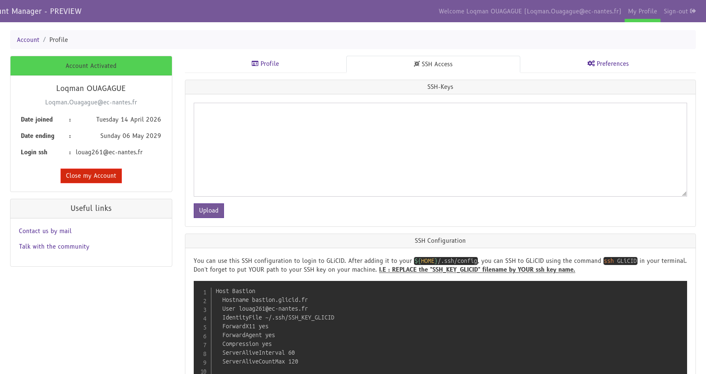
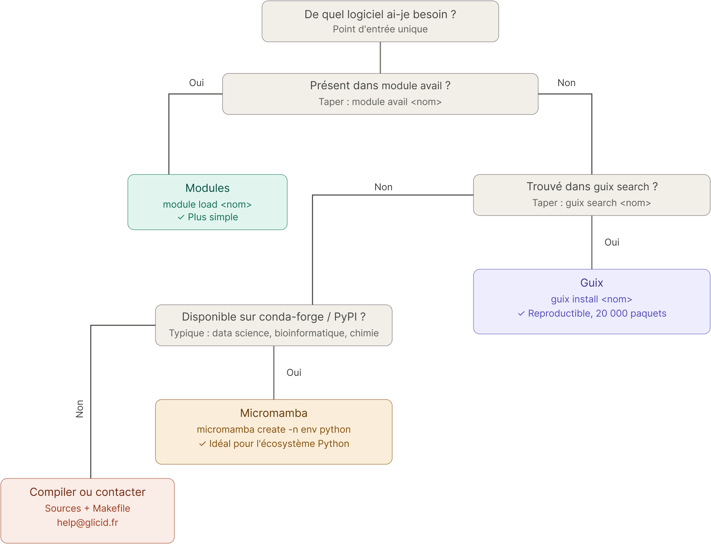
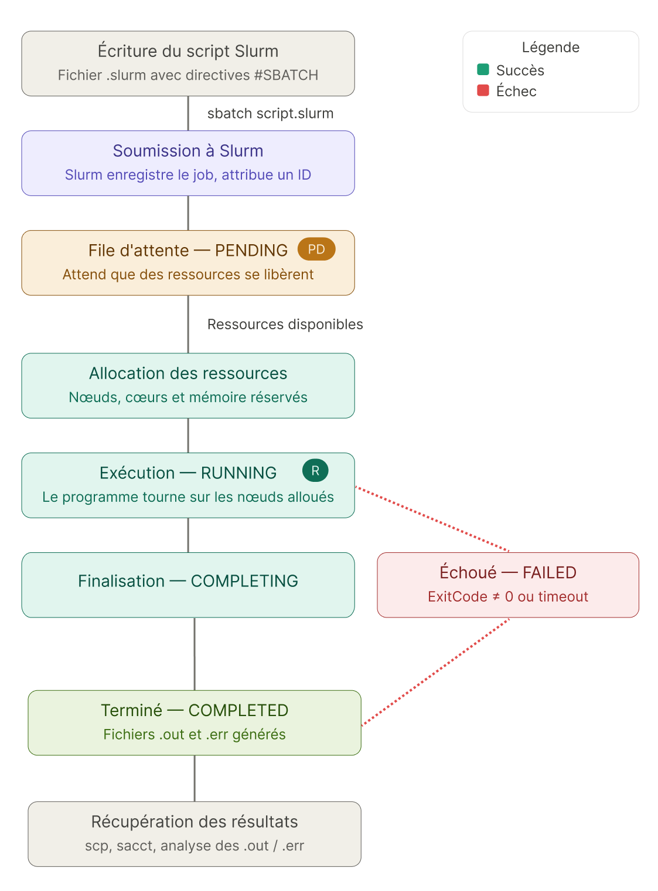

# Guide du débutant — Lancer un calcul sur le supercalculateur GLiCID

> **À qui s'adresse ce guide ?**  
>  À toute personne souhaitant utiliser pour la première fois un supercalculateur, sans expérience préalable en calcul haute performance. Aucun prérequis technique avancé n'est nécessaire.
## Prérequis 
Avoir un compte [CLAM](clam.glicid.com) activé et un projet actif.


## Partie 1 — Comprendre le monde du HPC : le jargon essentiel

Avant de taper la moindre commande, il est indispensable de parler la même langue que les ingénieurs systèmes. Voici les termes que vous rencontrerez à chaque étape.

### 1.1 Les grandes notions

**HPC — High Performance Computing (Calcul Haute Performance)**  
Désigne l'utilisation de machines très puissantes pour résoudre des problèmes qui seraient impossibles ou trop longs à traiter sur un ordinateur personnel. On parle aussi de *calcul intensif*.

**Cluster (grappe de serveurs)**  
Un supercalculateur n'est pas un seul et unique ordinateur gigantesque. C'est un ensemble de centaines ou milliers de serveurs (appelés *nœuds*) reliés entre eux par un réseau ultra-rapide et travaillant de concert. GLiCID est un cluster de ce type.

**Nœud (node)**  
Un nœud est un serveur individuel au sein du cluster. Il en existe plusieurs types :

| Type de nœud | Rôle |
|---|---|
| **Nœud de login (frontale)** | Point d'entrée où vous vous connectez. On n'y lance PAS de calculs. |
| **Nœud de calcul (compute node)** | Fait le "vrai" travail : exécute vos programmes. |
| **Nœud de stockage** | Héberge les systèmes de fichiers partagés (home, scratch…). |
|||

**CPU / Cœur (core)**  
Un CPU est un processeur. Chaque processeur contient plusieurs *cœurs*, c'est-à-dire des unités de calcul indépendantes. Un nœud de calcul peut embarquer des dizaines de cœurs.

**GPU**  
Processeur graphique, à l'origine conçu pour les jeux vidéo, mais devenu incontournable en IA et en simulation numérique grâce à sa capacité à exécuter des milliers de petits calculs en parallèle.

**RAM / Mémoire**  
Espace de travail temporaire d'un nœud. Plus votre programme manipule de données, plus il en a besoin.

**Parallélisme**  
Capacité à exécuter plusieurs calculs simultanément. On distingue :
- le **parallélisme à mémoire partagée** (OpenMP) : plusieurs cœurs d'un même nœud partagent la même RAM ;
- le **parallélisme à mémoire distribuée** (MPI) : plusieurs nœuds communiquent par le réseau.

### 1.2 Le stockage sur le cluster

Sur GLiCID, plusieurs espaces de stockage coexistent :

| Espace | Chemin | Sauvegardes | Usage recommandé |
|---|---|---|---|
| **Home** | `~` ou `/home/USER@ec-nantes.fr` | Oui | Vos scripts, configurations, petits fichiers |
| **Scratch** | variable* | Non | Données temporaires de calcul (rapide, pas sauvegardé) |
| **LAB-DATA** | Variable* | Oui | Résultats et données à conserver durablement |
| **Projet** | Variable*  | Oui | Collaboration d'équipe |

> ⚠️ **Règle d'or :** Placez vos fichiers temporaires sur le scratch, vos résultats importants sur LAB-DATA. Ne saturez jamais votre espace home.

\*consulter la section *Storage Spaces* de [la documentation](doc.glicid.fr) pour les chemins exactes.
### 1.3 L'ordonnanceur et les jobs

**Ordonnanceur (job scheduler)**  
Sur un cluster partagé entre des dizaines d'équipes, on ne peut pas exécuter des programmes directement. Un logiciel appelé *ordonnanceur* gère une file d'attente et attribue les ressources disponibles à chaque utilisateur de manière équitable. 

Par exemple, GLiCID utilise un ordonnanceur appelé Slurm (*Simple Linux Utility for Resource Management*). C'est le standard mondial pour les clusters HPC

**Job (tâche)**  
Un job est l'unité de travail que vous soumettez à l'ordonnanceur. Il contient les ressources demandées (nombre de cœurs, mémoire, durée, etc.) et les commandes à exécuter.

**Partition**  
Sous-ensemble de nœuds du cluster regroupés selon leurs caractéristiques (CPU seul, GPU, mémoire importante…). Vous choisissez la partition adaptée à votre calcul. Conférer la liste des partitions qui existe sur GLiCID [ici](https://doc.glicid.fr/GLiCID-PUBLIC/main/slurm/partitions.html).

**QoS (Quality of Service)**  
Priorité associée à votre job. Sur GLiCID, la QoS `short` correspond à des jobs de courte durée et bénéficie souvent d'une priorité plus élevée. Conférer la liste des QoS disponible sur GLiCID [ici](https://doc.glicid.fr/GLiCID-PUBLIC/main/slurm/qos.html).


## Partie 2 — Se connecter au cluster (SSH)

### 2.1 Qu'est-ce que SSH ?

SSH (*Secure Shell*) est un protocole qui permet d'ouvrir un terminal distant sur un serveur, de manière chiffrée et sécurisée. C'est la porte d'entrée unique vers le supercalculateur.

GLiCID utilise une architecture en deux étapes :

```
Votre machine → [Bastion] → [Nœud de login] → Nœuds de calcul
```

Le **bastion** (`bastion.glicid.fr`) est un serveur passerelle exposé sur Internet. Il filtre les connexions avant de les laisser passer vers les nœuds internes.

### 2.2 Générer une paire de clés SSH

L'authentification sur GLiCID ne se fait pas par mot de passe, mais par **paire de clés cryptographiques** :
- **Clé privée** : reste sur votre machine, ne la partagez jamais.
- **Clé publique** : déposée sur le serveur, elle permet de vous identifier.

Ouvrez un terminal (Linux/macOS) ou PowerShell (Windows) et tapez :

```bash
ssh-keygen -t ed25519 -f ~/.ssh/id_glicid -C "mon-email@exemple.fr"
```

Explication des options :
- `-t ed25519` : algorithme moderne et sécurisé (recommandé par GLiCID)
- `-f ~/.ssh/id_glicid` : nom du fichier de la clé (évite d'écraser une clé existante)
- `-C "..."` : commentaire pour identifier la clé

Le programme vous demande ensuite une **passphrase**, mot de passe protégeant la clé privée : choisissez-en une robuste.

Deux fichiers sont créés :
- `~/.ssh/id_glicid` — votre clé **privée** (ne jamais partager)
- `~/.ssh/id_glicid.pub` — votre clé **publique** (à déposer sur GLiCID)

### 2.3 Déposer votre clé publique sur GLiCID

Lors de la création de votre compte sur la plateforme CLAM de GLiCID, vous devrez fournir le contenu de votre clé publique. Affichez-le avec :

```bash
cat ~/.ssh/id_glicid.pub
```

Copiez la ligne affichée (elle commence par `ssh-ed25519`)

collez-la dans le champ dédié dans l'onglet **SSH Access** dans [votre **profile** CLAM](https://clam.glicid.fr/accounts/profile/). Ensuite, cliquez Upload.



### 2.4 Configurer le fichier `~/.ssh/config`

Plutôt que de taper de longues commandes à chaque connexion, configurez des raccourcis SSH. Créez ou éditez le fichier `~/.ssh/config` :

> **Windows** : utilisez VS Code ou Notepad++ — jamais le Bloc-notes classique qui peut corrompre le fichier.

```
Host Bastion
  Hostname bastion.glicid.fr
  User USER@ec-nantes.fr
  IdentityFile ~/.ssh/id_glicid
  ForwardX11 yes
  ForwardAgent yes
  Compression yes
  ServerAliveInterval 60
  ServerAliveCountMax 120

Host Glicid
  Hostname login-001.glicid.fr
  User USER@ec-nantes.fr
  ProxyJump Bastion
  IdentityFile ~/.ssh/id_glicid
  ForwardX11 yes
  ForwardAgent yes
  Compression yes
  ServerAliveInterval 60
  ServerAliveCountMax 120

Host Nautilus
  Hostname nautilus-devel-001.nautilus.intra.glicid.fr
  User USER@ec-nantes.fr
  ProxyJump Bastion
  IdentityFile ~/.ssh/id_glicid
  ForwardX11 yes
  ForwardAgent yes
  Compression yes
  ServerAliveInterval 60
  ServerAliveCountMax 120
```

Explication des directives importantes :

| Directive | Rôle |
|---|---|
| `ProxyJump Bastion` | Passe automatiquement par le bastion (tunnel) |
| `ForwardAgent yes` | Transmet votre clé SSH à travers la connexion (utile pour rebondir entre nœuds) |
| `ServerAliveInterval 60` | Envoie un signal toutes les 60 s pour éviter la déconnexion |
| `Compression yes` | Compresse les données pour accélérer la connexion |

### 2.5 Se connecter

Une fois le fichier configuré, la connexion se réduit à une seule commande :

```bash
# Se connecter au cluster Nautilus
ssh Nautilus
```
Vous verrez apparaître une bannière de bienvenue et vous serez sur le nœud de login, comme celle-ci:
```sh
#################################################################
#   This service is restricted to authorized users only. All    #
#            activities on this system are logged.              #
#  Unauthorized access will be fully investigated and reported  #
#        to the appropriate law enforcement agencies.           #
#################################################################


Last login: Tue Jan 01 00:00:00 2000 from 000.000.0.0
_   _             _   _ _                    lxkkdc 
| \ | |           | | (_) |                   kWNOdc
|  \| | __ _ _   _| |_ _| |_   _ ___          kW0c
| . ` |/ _` | | | | __| | | | | / __|         kW0c
| |\  | (_| | |_| | |_| | | |_| \__ \         kW0c
\_| \_/\__,_|\__,_|\__|_|_|\__,_|___/        cOWKl
                                         cx0KXWMWXK0xc
                                ccllllloxXWMMMMMMMMMWKo
         coooolc       codxkO0KXXNNNWWWWWMMMMMMMMMMMMWOl
        c0WWWWWO   oxOKNWMMMMMMMMMMMMMMMMMMMMMMMMMMMMMWNKOxoc
        lKMMMMMKxOXWMMMMMMMMMMMMMMMMMMMMMMMMMMMMMMMMMMMMMMMWXOdc
        lKMMMMMWWMMMMMMMMMMMMMMMMMMMMMMMMMMMMMMMMMMMMW0xdx0NMMWKx
        lKMMMMMMMMMMMMMMMMMMMMMMMMMMMMMMMMMMMMMMMMMMWO     kWMMMWOc
        lKMMMMMMMMMMMMMMMMMMMMMMMMMMMMMMMMMMMMMMMMMMWOc    kWMMMMNd
        lKMMMMMMMMMMMMMMMMMMMMMMMMMMMMMMMMMMMMMMMMMMMWKkxkKWMMMMMNd
        lKMMMMMMMMMMMMMMMMMMMMMMMMMMMMMMMMMMMMMMMMMMMMMMMMMMMMMMXx
        lKMMMMMNNWMMMMMMMMMMMMMMMMMMMMMMMMMMMMMMMMMMMMMMMMMMMWXkl
        lKMMMMM0ookKNWMMMMMMMMMMMMMMMMMMMMMMMMMMMMMMMMMMMWNKOdc
        ckKKKKKx    ldkOKXNWMMMMMMMMMMMMMMMMMMMMMMMWNXK0kdl
                         clodxkkO000KKKKKKK000OOkxdolc
      
-----------------------------------------------------------------------------
   Welcome to GLiCID HPC cluster Nautilus


```


> ⚠️ **Important :** Le nœud de login est un espace de préparation, pas un espace de calcul. N'y lancez jamais de programmes gourmands en CPU ou en RAM — vous pénaliseriez tous les autres utilisateurs connectés.

### 2.6 Transférer des fichiers

Pour copier des fichiers entre votre machine et le cluster :

```bash
# Envoyer un fichier local vers votre home sur GLiCID
scp mon_script.py Nautilus:~/

# Récupérer un fichier depuis le cluster
scp Nautilus:~/resultats/output.txt ./

# Transférer un dossier entier (-r pour récursif)
scp -r mon_dossier/ Nautilus:~/projets/
```
**Remarque:** Sur Windows, vous pouvez utiliser le logiciel [**WinSCP**](https://winscp.net/eng/download.php) qui fourni une interface graphique pour gérer les fichiers sur le cluster.
## Partie 3 — Installer et gérer ses logiciels sur GLiCID

Sur un supercalculateur partagé, vous n'avez pas les droits administrateur (`root`). Impossible donc d'utiliser `apt install` ou `yum install` comme sur votre machine personnelle. GLiCID met à disposition trois mécanismes complémentaires pour gérer vos logiciels, chacun répondant à un besoin différent.

| Outil | Idéal pour | Sans droits root ? |
|---|---|---|
| **Modules** | Logiciels scientifiques lourds préinstallés par les admins | Oui |
| **Guix** | Tout logiciel, reproductibilité garantie, sans admin | Oui |
| **Micromamba** | Ecosystème Python/conda, paquets PyPI et conda-forge | Oui |

---

### 3.1 Les modules — accéder aux logiciels préinstallés

Les modules sont la solution la plus simple : les administrateurs ont déjà compilé et optimisé des dizaines d'applications scientifiques pour le matériel de GLiCID. Un simple `module load` suffit pour les activer.

#### Voir ce qui est disponible

```bash
# Lister tous les modules
module avail

# Chercher un logiciel précis (exemple : OpenFOAM)
module avail openfoam
```

Sur Nautilus, vous trouverez notamment : Gaussian, LAMMPS, OpenFOAM, ORCA, VASP, TurboMole, ParaView, GCC, Intel oneAPI, CUDA, HDF5, FFTW, et bien d'autres.

#### Charger, lister, décharger

```bash
# Charger un module
module load gcc/13.1.0

# Charger plusieurs modules en une seule commande
module load gcc/13.1.0 openmpi/ucx/4.1.5_gcc_8.5.0_ucx_1.14.1_rdma_46.0 hdf5/1.14.1-2_gnu

# Voir les modules actuellement chargés (dépendances comprises)
module list

# Décharger un module
module unload gcc/13.1.0

# Décharger tous les modules d'un coup
module purge

# Changer de version d'un module
module switch nvhpc/22.7 nvhpc/23.9

# Afficher ce que fait concrètement un module (variables modifiées)
module show gcc/13.1.0
```

> ⚠️ **Règle importante :** Chargez toujours vos modules dans votre script Slurm, pas seulement dans votre session interactive. Les nœuds de calcul démarrent avec un environnement vide.

### 3.2 Guix — le gestionnaire de paquets universel

Guix est le gestionnaire de paquets natif de GLiCID. Sa force : plus de **20 000 paquets** disponibles, des environnements totalement reproductibles, et une installation sans droits administrateur. Contrairement aux modules, vous n'attendez pas qu'un admin installe ce dont vous avez besoin — vous le faites vous-même.
#### Pourquoi Guix plutôt que les modules ?

- Vous avez besoin d'un logiciel absent des modules
- Vous voulez une version précise d'un logiciel
- Vous travaillez sur plusieurs projets avec des dépendances conflictuelles
- Vous voulez garantir la reproductibilité de votre environnement

#### Premiers pas : activer Guix sur Nautilus

Sur le cluster Nautilus, Guix est accessible via un module :

```bash
module load guix/latest
```

Ensuite, lors de votre **toute première utilisation**, mettez à jour les définitions de paquets :

```bash
guix pull
```

> Cette commande télécharge les dernières définitions de paquets depuis les dépôts GLiCID. Elle peut prendre quelques minutes. Déconnectez-vous puis reconnectez-vous après cette étape pour que les changements soient pris en compte.

Sur les machines de type "Guix system" (frontales, nœuds vm-compute), Guix est directement disponible sans `module load`.

#### Chercher et installer des paquets

```bash
# Chercher un paquet
guix search python

# Chercher avec un mot-clé plus précis
guix search "machine learning"

# Installer un paquet dans votre profil personnel
guix install python

# Installer plusieurs paquets
guix install python python-numpy python-scipy python-matplotlib

# Afficher les informations d'un paquet
guix show python-numpy
```

Les paquets sont installés dans `/gnu/store/` avec un chemin unique incluant un hash (ex. `/gnu/store/d9r7...8zvk-python-3.11.0`). Cela garantit qu'aucune installation ne peut en "écraser" une autre et que l'environnement est identique sur tous les nœuds du cluster.

#### Utiliser `guix shell` — environnements temporaires

`guix shell` est idéal pour tester un logiciel sans l'installer dans votre profil :

```bash
# Ouvrir un shell avec Python et NumPy disponibles temporairement
guix shell python python-numpy

# Dans ce shell, python et numpy sont disponibles
python -c "import numpy; print(numpy.__version__)"
# Ctrl+D pour quitter le shell temporaire
```


### 3.3 Micromamba — l'écosystème Python/conda sur GLiCID

Si votre logiciel est disponible sur `conda-forge` (très courant en data science, bioinformatique, chimie computationnelle) mais pas dans Guix, micromamba est votre outil. C'est une réimplémentation ultra-rapide de `conda` en C++, recommandée par GLiCID à la place de `conda` classique.

#### Pourquoi micromamba et pas conda ?

- `conda` disponible dans Guix présente des bugs d'initialisation sur GLiCID
- `micromamba` est bien plus rapide (écrit en C++, pas en Python)
- `micromamba` n'a pas d'environnement `base` — impossible de "casser" l'installation

#### Installation de micromamba (à faire une seule fois)

GLiCID héberge un binaire statique de micromamba sur son propre serveur d'artefacts :

```bash
# Créer le dossier local si nécessaire
mkdir -p $HOME/.local/bin

# Télécharger micromamba depuis les serveurs GLiCID
wget -P $HOME/.local/bin https://s3.glicid.fr/pkgs/micromamba

# Rendre le binaire exécutable
chmod u+x $HOME/.local/bin/micromamba

# Initialiser micromamba (stockage dans /micromamba/$USER/ sur le stockage partagé)
$HOME/.local/bin/micromamba -r /micromamba/$USER/ shell init --shell=bash --prefix=/micromamba/$USER/

# [Optionnel] Créer un alias 'conda' pointant vers micromamba
echo -e '\n\n# Alias conda avec micromamba\nalias conda=micromamba' >> ~/.bashrc

# Recharger la configuration shell
source ~/.bashrc
```

> Le répertoire `/micromamba/$USER/` se trouve sur le stockage partagé du cluster : vos environnements sont accessibles depuis tous les nœuds.

Vérifiez l'installation :

```bash
micromamba --version
# -> 1.4.0 (ou version plus récente)
```

#### Créer et gérer des environnements

```bash
# Créer un environnement vide
micromamba create -n mon_env

# Créer un environnement avec Python et quelques paquets directement
micromamba create -n ml_env python=3.11 numpy scipy matplotlib scikit-learn -c conda-forge

# Activer un environnement
micromamba activate mon_env
# -> Le prompt devient : (mon_env) [login@nautilus ~]$

# Installer des paquets dans l'environnement actif
micromamba install -c conda-forge pytorch torchvision

# Installer un paquet PyPI (quand absent de conda)
pip install mon-paquet-specifique

# Lister les paquets installés dans l'environnement
micromamba list

# Désactiver l'environnement
micromamba deactivate

# Lister tous les environnements existants
micromamba env list

# Supprimer un environnement
micromamba env remove -n mon_env
```

#### Exporter et partager un environnement

```bash
# Exporter la liste exacte des paquets installés
micromamba env export -n mon_env > environment.yml

# Recréer l'environnement depuis le fichier exporté (reproductibilité)
micromamba env create -f environment.yml
```
---

### 3.4 Choisir le bon outil — arbre de décision


---

## Partie 4 — Coder sur le cluster avec VS Code (Remote SSH)

Éditer vos scripts directement sur le cluster depuis votre machine locale — sans copier-coller, sans FileZilla, sans nano dans un terminal — c'est possible grâce à l'extension **Remote - SSH** de VS Code. Vous bénéficiez de toute l'interface VS Code (coloration syntaxique, autocomplétion, débogage, terminal intégré) tout en travaillant sur les fichiers qui se trouvent sur GLiCID.


### 4.1 Prérequis

Sur **votre machine locale** :
- [VS Code](https://code.visualstudio.com/) installé
- L'extension **Remote - SSH** de Microsoft installée
- Votre clé SSH configurée (`~/.ssh/config`) comme décrit en Partie 2

### 4.2 Installer l'extension Remote - SSH

1. Ouvrez VS Code
2. Cliquez sur l'icône Extensions dans la barre latérale gauche (ou `Ctrl+Shift+X`)
3. Cherchez `Remote - SSH` (éditeur : Microsoft)
4. Cliquez sur **Installer**

L'extension ajoute une icône `><`  dans le coin inférieur gauche de VS Code.

### 4.4 Se connecter à GLiCID

VS Code lit automatiquement votre fichier `~/.ssh/config`. Si vous avez configuré les alias `Nautilus` ou `Glicid` comme en Partie 2, ils apparaissent directement dans la liste.

1. Appuyez sur `Ctrl+Shift+P` (ou `Cmd+Shift+P` sur Mac)
2. Tapez `Remote-SSH: Connect to Host...` et appuyez sur Entrée
3. Sélectionnez `Nautilus` (ou `Glicid`) dans la liste
5. Attendez quelques secondes que `vscode-server` s'installe (première connexion uniquement)


### 4.5 Ouvrir un dossier de travail

Une fois connecté, ouvrez votre répertoire de travail sur le cluster :

1. `Fichier > Ouvrir le dossier...` (ou `Ctrl+K Ctrl+O`)
2. Naviguez jusqu'à votre dossier (ex. `/home/votre-login/projets/mon-calcul/`)
3. Cliquez sur **OK**

L'explorateur de fichiers à gauche affiche maintenant le contenu de ce dossier sur GLiCID. Vous pouvez créer, éditer, renommer des fichiers exactement comme en local.

### 4.6 Utiliser le terminal intégré

Le terminal intégré de VS Code (`Terminal > Nouveau terminal`) ouvre directement un shell sur le nœud de login de GLiCID. C'est depuis là que vous soumettrez vos jobs :

```bash
# Vérifier que vous êtes bien sur GLiCID
hostname
# -> login-001.glicid.fr

# Soumettre un job Slurm
sbatch mon_script.slurm

# Surveiller la file d'attente
squeue --me
```

Vous pouvez ouvrir plusieurs terminaux simultanément et les afficher côte à côte.


### 4.7 Configurer l'interpréteur Python (avec micromamba)

Si vous utilisez un environnement micromamba, indiquez à VS Code quel interpréteur utiliser :

1. Ouvrez la palette de commandes (`Ctrl+Shift+P`)
2. Tapez `Python: Select Interpreter`
3. Cliquez sur **Enter interpreter path...**
4. Saisissez le chemin vers l'interpréteur de votre environnement :

```
/micromamba/votre-login/envs/mon_env/bin/python
```

VS Code utilisera désormais cet interpréteur pour l'autocomplétion, le linting et l'exécution.


## Partie 5 — Soumettre un calcul avec Slurm

### 5.1 Comment fonctionne Slurm ?

Voici le cycle de vie d'un job sur GLiCID :



Slurm lit votre script, extrait les ressources demandées (lignes `#SBATCH`), puis exécute les commandes du script sur les nœuds qu'il vous attribue.

### 5.2 Anatomie d'un script Slurm

Un script Slurm est un fichier shell Bash enrichi de directives spéciales commentées `#SBATCH`. Ces directives sont lues par Slurm avant l'exécution.

```
┌──────────────────────────────────────────────────────────────┐
│  #!/bin/bash           ← Shebang : interpréteur Bash         │
│  #SBATCH --...         ← Directives Slurm (ressources)       │
│  #SBATCH --...                                               │
│                                                              │
│  module load ...       ← Chargement des logiciels           │
│  srun ./mon_programme  ← Commande de calcul                  │
└──────────────────────────────────────────────────────────────┘
```

### 5.3 Script exemple

```bash
#!/bin/bash

# BEGIN MANDATORY OPTIONS
#SBATCH --time=0-00:00:00       # Time limit DD-HH:MM:SS
#SBATCH --qos= CHANGE_ME            # priority/quality of service,
#SBATCH --account= CHANGE_ME      # Replace with your project/account name
# END MANDATORY OPTIONS

# BEGIN INFORMATIONAL OPTIONS
#SBATCH --job-name= CHANGE_ME        # Name for your job
#SBATCH --comment= CHANGE_ME # Comment for your job
#SBATCH --output=%j.out      # Output file
#SBATCH --error=%j.err       # Error file
#SBATCH --mail-type=BEGIN,END,FAIL   # Mail on start and end job
#SBATCH --mail-user= CHANGE_ME  # Email address where to recieve the notifications about your job
# END INFORMATIONAL OPTIONS

# BEGIN RESOURCES OPTIONS
#SBATCH --partition= CHANGE_ME      
#SBATCH --ntasks= CHANGE_ME            # How many CPUs to use
# END RESOURCES OPTIONS


# BEGIN JOB

# Load the necessary modules 
module purge # Clear all loaded modules to avoid conflicts
module load python/3.13.4
python3 my_script.py
```

### 5.4 Les directives `#SBATCH` les plus utiles

| Directive | Exemple | Description |
|---|---|---|
| `--job-name` | `--job-name=simu` | Nom du job |
| `--output` | `--output=%x_%j.out` | Fichier de sortie stdout |
| `--error` | `--error=%x_%j.err` | Fichier de sortie stderr |
| `--partition` | `--partition=standard` | Partition cible |
| `--qos` | `--qos=short` | Qualité de service |
| `--time` | `--time=2-12:00:00` | Limite de temps (J-HH:MM:SS) |
| `--nodes` | `--nodes=2` | Nombre de nœuds |
| `--ntasks` | `--ntasks=8` | Nombre de coeurs CPU |
| `--mail-user` | `--mail-user=a@exem.com`| Adresse mail pour recevoir les notifications de la tâches |
| `--mail-type` | `--mail-type=BEGIN,END,FAIL` | Type de notification à recevoir |
| `--gres` | `--gres=gpu:X` | pour utiliser X carte(s) GPU|
> ⚠️ **Important :** Si la tâches que vous éxecuter a besoin des ressource GPU, il faut choisir la partition gpu car les autres partitions ne possèdent pas ces cartes.
### 5.6 Les commandes Slurm essentielles

**Soumettre un job :**

```bash
sbatch mon_script.slurm
# Réponse : Submitted batch job 3113275
```

**Vérifier l'état de votre file :**

```bash
# Voir tous vos jobs
squeue --me

# Voir tous les jobs du cluster
squeue

# Affichage typique :
# JOBID  PARTITION   NAME     USER  ST    TIME  NODES NODELIST(REASON)
# 3113275  standard  simu     jdoe   R    0:42      1 cnode042
# 3113276  standard  simu2    jdoe  PD    0:00      1 (Priority)
```

Les états importants (`ST`) :
- `PD` (*Pending*) : en file d'attente, attend des ressources
- `R` (*Running*) : en cours d'exécution
- `CG` (*Completing*) : en cours de finalisation
- `F` (*Failed*) : échec

**Annuler un job :**

```bash
scancel 3113275          # Annuler le job n°3113275
scancel --me             # Annuler TOUS vos jobs
```

**Obtenir des informations sur les partitions disponibles :**

```bash
sinfo
```

**Consulter les détails d'un job terminé :**

```bash
sacct -j 3113275 --format=JobID,State,Elapsed,MaxRSS,ExitCode
```

**Lancer un job interactif (pour tester) :**

```bash
# Demander une session interactive sur 1 nœud avec 2 cœurs pendant 1 heure
srun --nodes=1 --ntasks=1 --cpus-per-task=2 --time=01:00:00 --pty bash -i
```

---

## Partie 6 — Bonnes pratiques et conseils

### 6.1 Estimer correctement ses ressources

Ne demandez pas plus de ressources que nécessaire :
- Un job qui demande trop de cœurs restera plus longtemps en file d'attente.
- Un job qui dépasse le temps demandé est **tué automatiquement** par Slurm.

Commencez toujours par un test court (`--qos=short`, `--time=00:10:00`) avant de lancer un calcul de production.

### 6.2 Gérer son stockage

```bash
# Vérifier votre quota de stockage
quota -s

# Nettoyer les fichiers temporaires du scratch régulièrement
rm -rf /scratch/$USER/calcul_termine/
```

- **Scratch** : rapide, non sauvegardé → données de calcul en cours
- **Home** : lent, sauvegardé → scripts et configurations
- **LAB-DATA** : sauvegardé → résultats finaux à conserver

### 4.3 Charger les modules logiciels
Chargez toujours vos modules dans le script Slurm, pas seulement en interactif.

## Annexe — Référence rapide des commandes

| Commande | Action |
|---|---|
| `ssh Nautilus` | Se connecter au cluster |
| `scp fichier Nautilus:~/` | Envoyer un fichier |
| `sbatch script.slurm` | Soumettre un job |
| `squeue --me` | Voir mes jobs |
| `scancel <jobid>` | Annuler un job |
| `sinfo` | État des partitions |
| `sacct -j <jobid>` | Infos sur un job terminé |
| `module avail` | Lister les logiciels |
| `module load <nom>` | Charger un logiciel |

## Ressources pour aller plus loin

- Documentation officielle GLiCID : [doc.glicid.fr](https://doc.glicid.fr)
- Documentation Slurm officielle : [slurm.schedmd.com](https://slurm.schedmd.com)
- Créer un compte : plateforme CLAM de GLiCID


